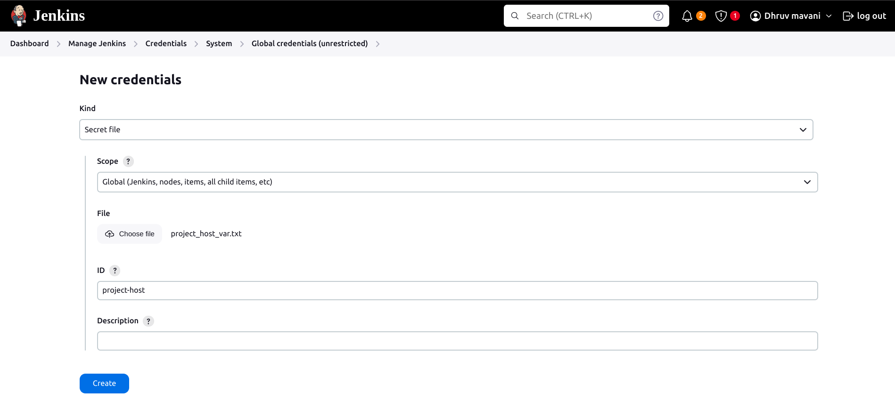

# Jenkins Pipeline
Details about all pipeline!!

## Kubernets_Deployment_Pipeline
This Pipeline is for EKS Deployment & do below things,  <br/>

1 - Create Docker Images From Dockerfile <br/>
2 - Push Image to ECR <br/>
3 - Update Image in EKS deployment. <br/>

## Learning
All learning Pipeline for Jenkins.

## Flutter_Pipeline
```
├── Jenkinsfile
├── With_Test_Cases
│   └── Jenkinsfile
└── With_Test_Cases_AND_Jenkins_Secrates
    ├── fidali_host_var.txt
    └── Jenkinsfile
```

### Jenkinsfile
This pipeline **builds an APK**, uploads it to **S3 Bucket**, and **sends an email** to receivers.  

#### 📌 Commit Message Rules  

| Commit Message       | Builds APK?          |
|----------------------|----------------------|
| `stag-build`        | ✅ Create Staging Build    |
| `prod-build`        | ✅ Create Production Build |
| `<Other-commit-messge>`   | ❌  No Build |

> ⚠️ **NOTE:**  
> Ensure your commit messages follow the correct format to trigger the pipeline.

---

### With_Test_Cases
This pipeline **builds an APK**, uploads it to **S3 Bucket**, and **sends an email** to receivers. But this also run **Test Cases** if suitable commit messge is done.

#### 📌 Commit Message Rules  

| Commit Message                  | Runs Test Case?       | Builds APK?          |
|----------------------------------|----------------------|----------------------|
| `stag-build worker_test.dart`   | ✅ `worker_test.dart` | ✅ Create Staging Build    |
| `prod-build demo_test.dart`     | ✅ `demo_test.dart`   | ✅ Create Production Build |
| `stag-build`                    | ❌ No test case      | ✅ Create Staging Build    |
| `prod-build`                    | ❌ No test case      | ✅ Create Production Build |
| `worker_test.dart`              | ❌ No test case      | ❌ No Build        |

> ⚠️ **NOTE:**  
> To trigger the pipeline, use the correct commit message format.  

---

### With_Test_Cases_AND_Jenkins_Secrates
This pipeline **builds an APK**, uploads it to **S3 Bucket**, and **sends an email** to receivers. But this also run **Test Cases** if suitable commit messge is done.

**💡 In this method, we store all environment variables in Jenkins credentials as a secret and use them in the pipeline.**

#### How to Create Secrate File name "fidali_host_var.txt" in jenkins,

1 -  **Navigate to:**  
   - Jenkins ➝ **Manage Jenkins**  
   - **Credentials** ➝ System ➝ Global credentials (unrestricted)  



- We define an ID (like 'fidali_host_var') when we are setting up secrets in jenkins credentials and use it in Jenkinsfile.
```json
    ...
    stage('Load Environment Variables') {
        steps {
            script {
                withCredentials([file(credentialsId: 'fidali_host_var', variable: 'ENV_FILE')]) {
                    .....
                    .....
                }
            }
        }
    }
```

#### 📌 Commit Message Rules  

| Commit Message                  | Runs Test Case?       | Builds APK?          |
|----------------------------------|----------------------|----------------------|
| `stag-build worker_test.dart`   | ✅ `worker_test.dart` | ✅ Create Staging Build    |
| `prod-build demo_test.dart`     | ✅ `demo_test.dart`   | ✅ Create Production Build |
| `stag-build`                    | ❌ No test case      | ✅ Create Staging Build    |
| `prod-build`                    | ❌ No test case      | ✅ Create Production Build |
| `worker_test.dart`              | ❌ No test case      | ❌ No Build        |

> ⚠️ **NOTE:**  
> To trigger the pipeline, use the correct commit message format.  


